# PROJECT PORTOFOLIO

## [10 AndaruDelivery](#github-custom-emoji)

## [1 Contact](https://github.com/eldirb21/Contact)

This application is a contact application where users can be added and their data can also be changed, what makes it simple is that users can be searched easily.

    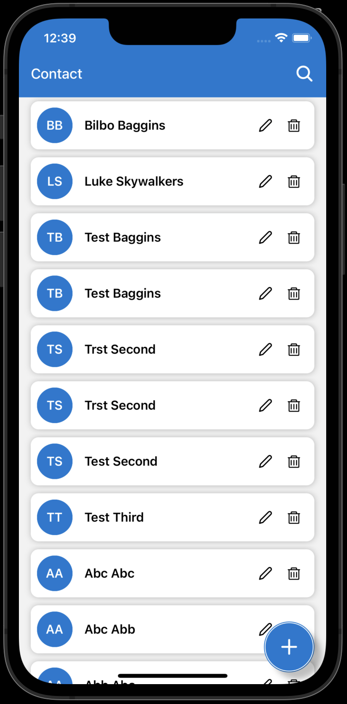 
    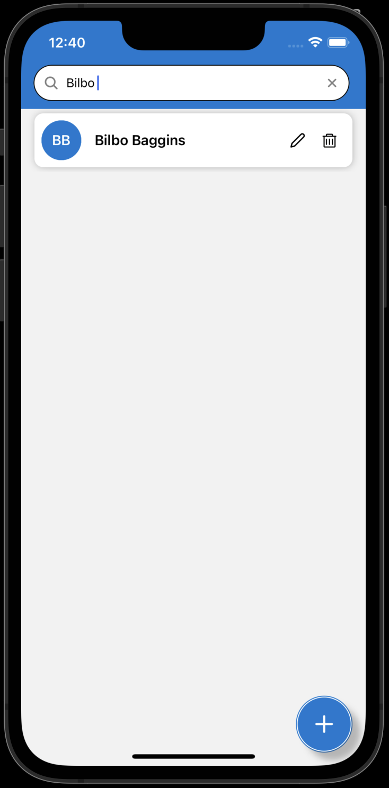 
    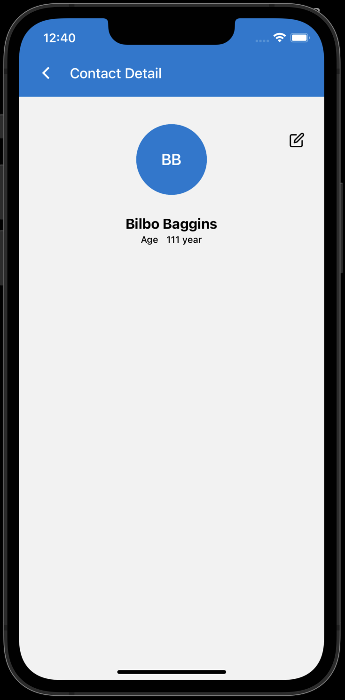
    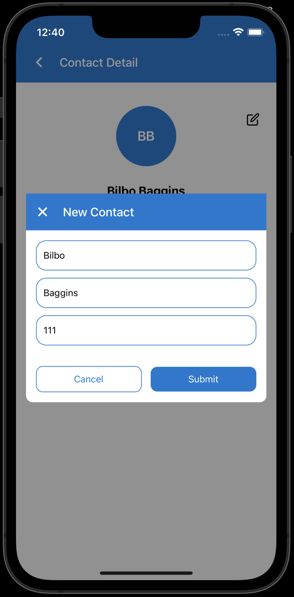
    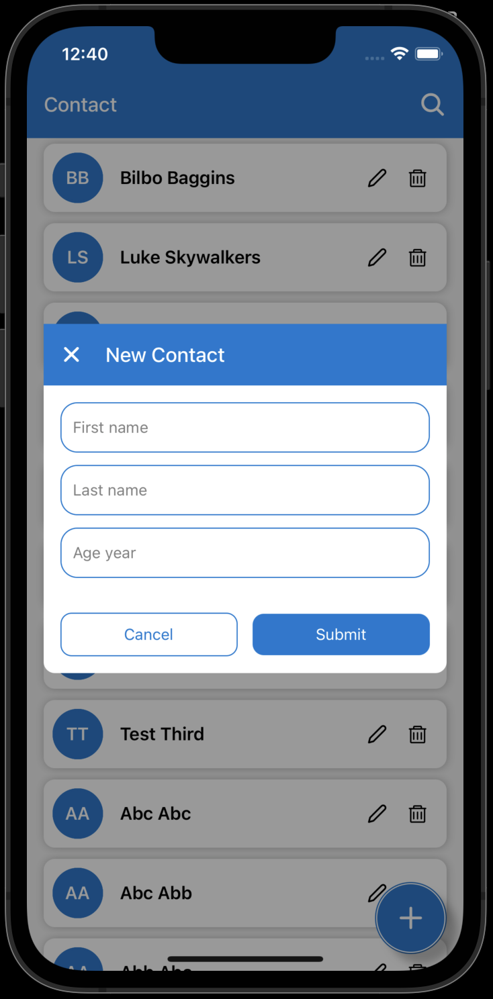

## [2 BookStore](https://github.com/eldirb21/Book-Store)

This application is an online book selling application, where it is hoped that the books purchased can be obtained physically and also digitally, making it easier for users and attracting users to read books anywhere.

    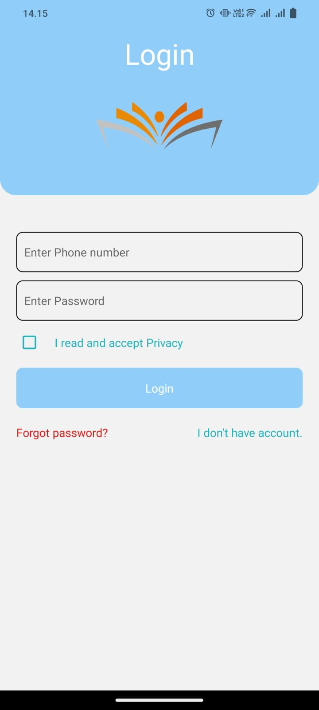
    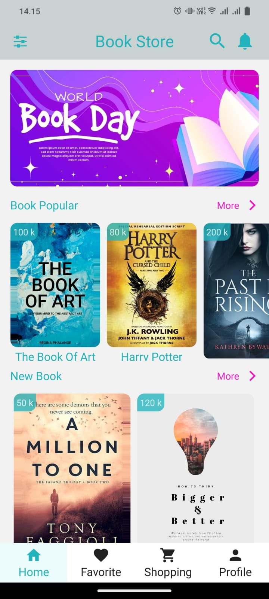 
    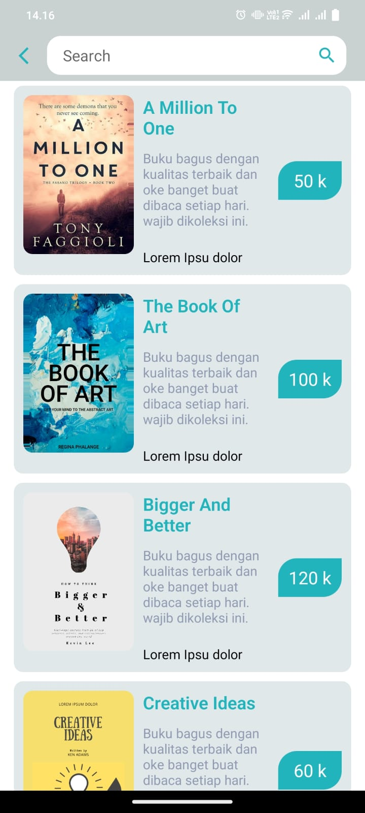
    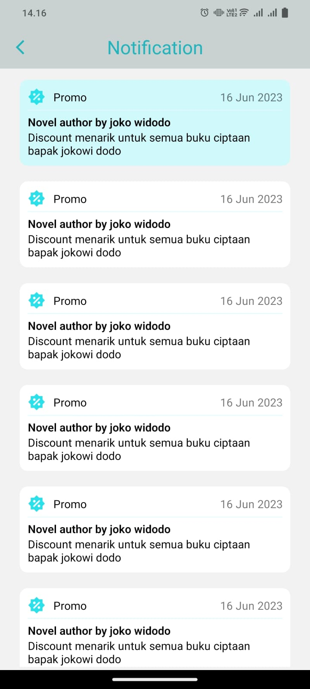 
    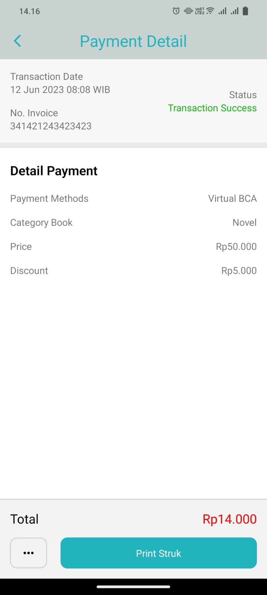
    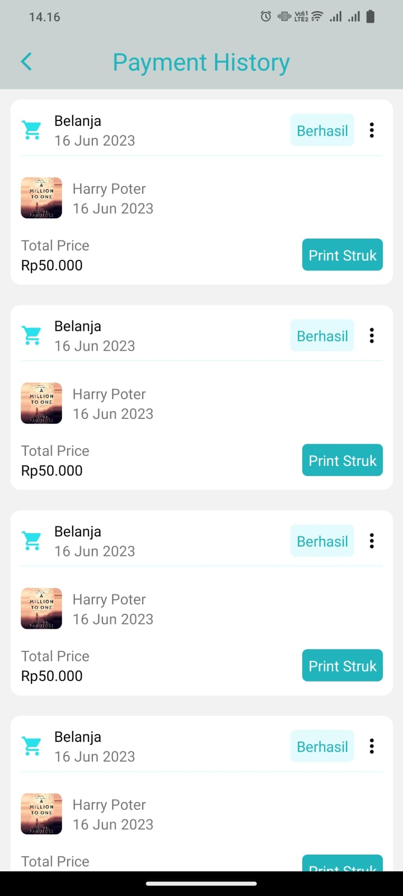

## [3 Movies](https://github.com/eldirb21/Movies)

This movies application is an application that is designed to be simple for users or users, the goal is to make it easier for users to search and book movies they want to watch, the advantage of this application is that users can choose based on the best rating, so the movies they watch don't disappoint.

    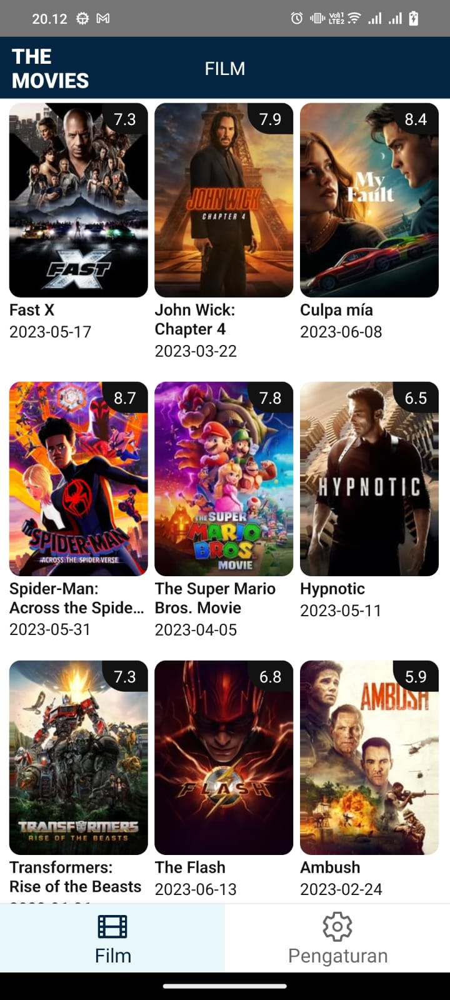 
    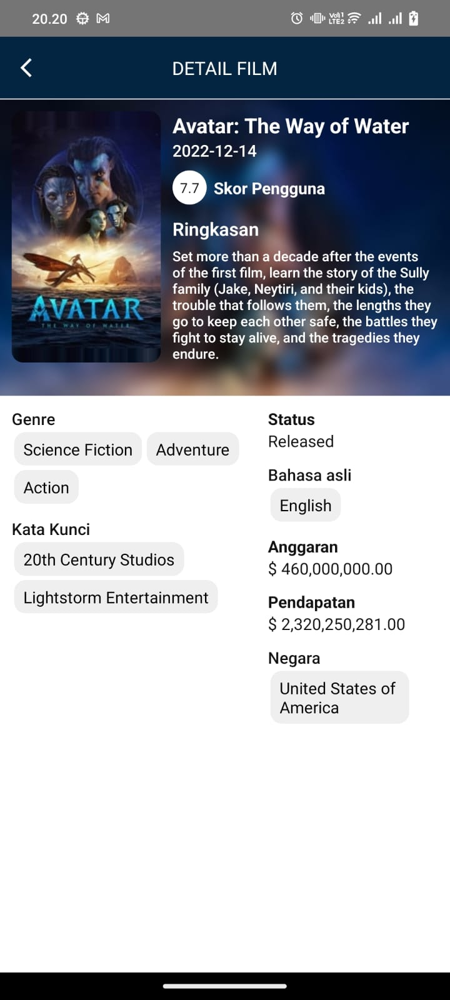 
    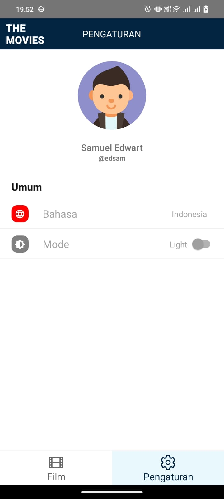
    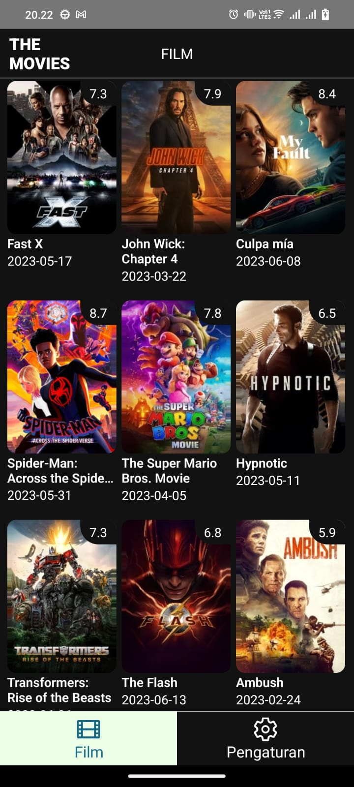
    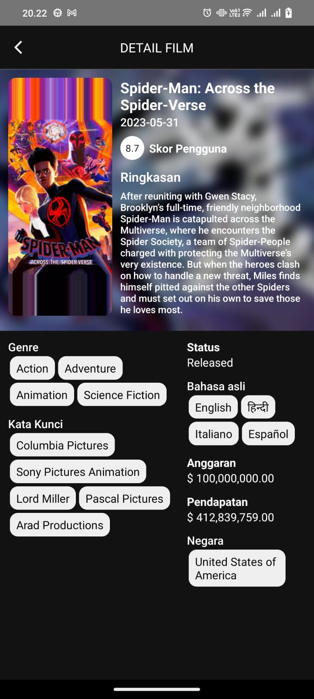
    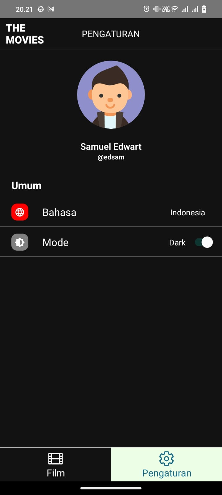

## [4 TemuAkrab](https://github.com/eldirb21/TEMUAKRAB)

This application is a scanning application for invited guests, you can search based on data in the backoffice or via a qr code scan, and will display the number of guests, table numbers, and the number who have arrived.

    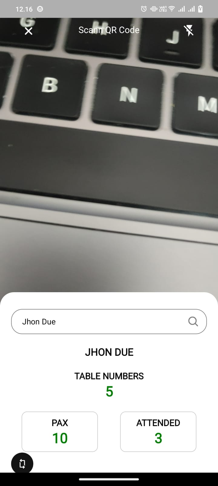 
    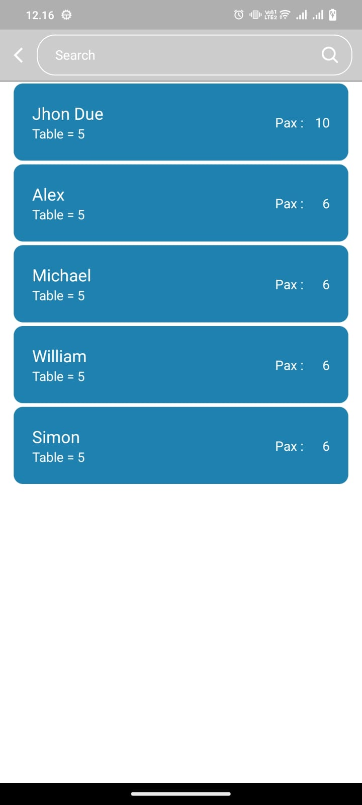 
    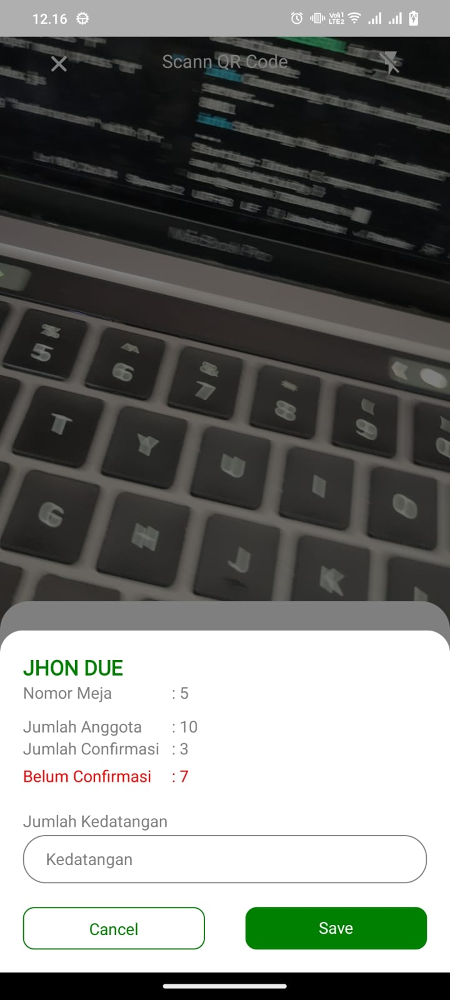
    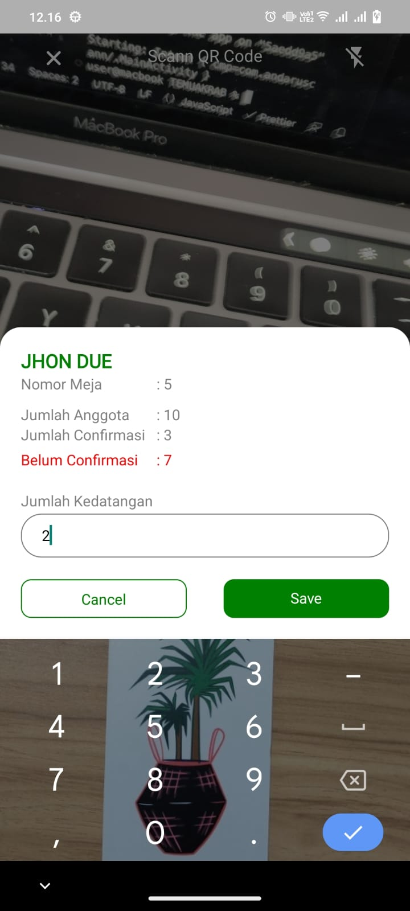

## [6 CryptoMarket](https://github.com/eldirb21/crypto-market)

## [7 FotoFoto](#private)

## [8 MySupir](#private)

## [9 Mobbi](#private)

## [10 AndaruCollection](#private)

AndaruCollection is an internal company application, made specifically to support employee activities, especially the collector division when collecting installments, the advantages of this application lie in its features, including tracking, documents, address users, a more organized admin helper.

## [10 AndaruDelivery](#private)

#### [\*\*Sorry, not all applications can be displayed on the screen, especially the source code for this application cannot be published, because this application is private](#private)
