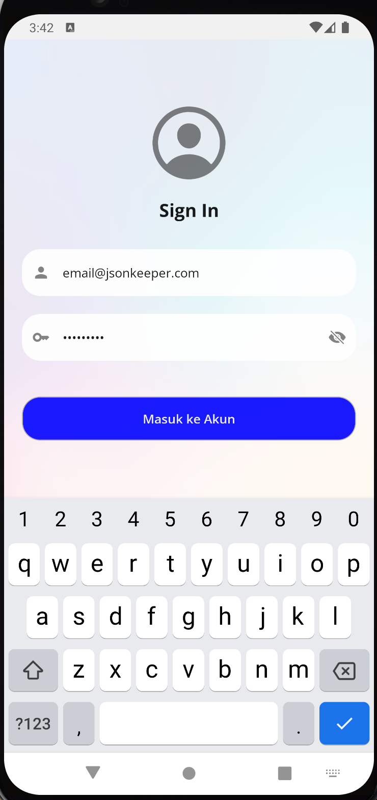
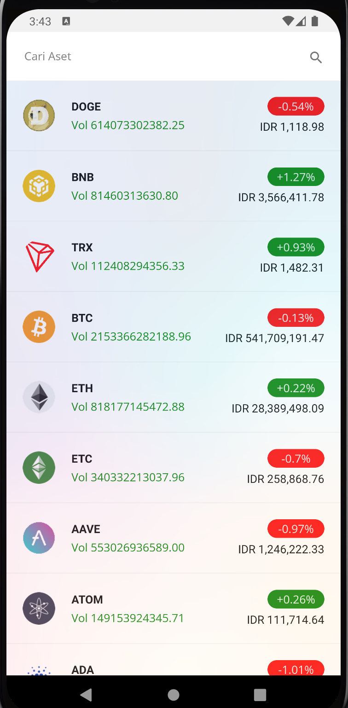
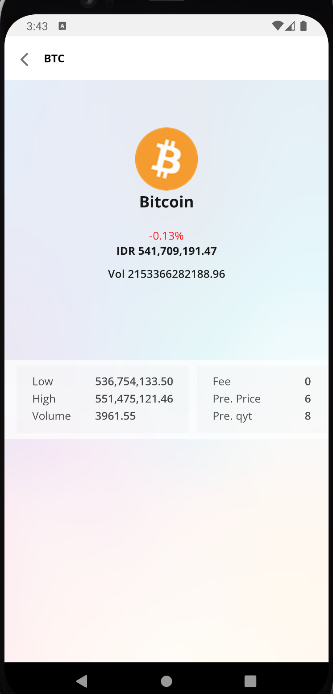
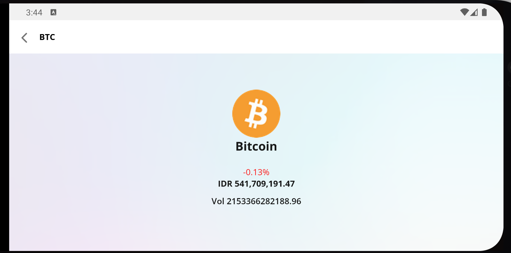

# PROJECT PORTOFOLIO

SEARCH ME IN [DRIVER](https://drive.google.com/drive/folders/1AGourakQyBU_ZRR5103rYIzBZ-KGE9UT?usp=sharing)

## [1 Andaru Collection](#private)

This application is an internal company application, made specifically to support employee activities, especially the collector division when collecting installments, the advantages of this application lie in its features, including tracking, documents, address users, a more organized admin helper.

### Features

```sh
- Journey
- Activity
- Task
- Checkin
- Checkout
- Start
- Finish
- Notification
- Maps Location
- Payment
- Login
```

### Skills Used

```sh
- React-native
- Axios
- Local Storage
- Rest Api
- Ui/ux
- Figma
- SQlite
- Geolocation
- Redux
```

## [2 Mobbi](https://play.google.com/store/apps/details?id=com.astra.mobil88)

This application is an application for buying and selling used cars, which is integrated with payment, test driving, auctions, and sharing features that help make it easier for buyers.

[Play Store](https://play.google.com/store/apps/details?id=com.astra.mobil88)

### Features

```sh
- Auth
- Buy Car
- Sell Car
- Car Auction
- Trade in
- Preorder
- Promo
- Otp
- Payment
- Notification
- Search
- CheckOut
```

### Skills Used

```sh
- React-native
- Axios
- Local Storage
- Rest Api
- Ui/ux
- Figma
- SQlite
- Redux
- Firebase
- Google Sign
- Camera
- Jwt Token
- Unit test
```

## [3 MySupir](https://play.google.com/store/apps/details?id=com.driver.mysupir)

This application is an application for ordering pick-up and delivery of customers.

[Play Store](https://play.google.com/store/apps/details?id=com.driver.mysupir)

### Features

```sh
- Auth
- Order
- Payment
- Notification
- Tracking
- Preorder
- Promo
- Otp
- Midtrans Payment
```

### Skills Used

```sh
- React-native
- Axios
- Local Storage
- Rest Api
- Ui/ux
- Figma
- Redux
- Firebase
- Google Sign
- Camera
- Jwt Token
- Unit test
```

## [4 Exchange](https://github.com/eldirb21/TestMobile)

This exchange application is a simple application that displays a list of crypto with daily volume and price.

### Features

```sh
- Auth
- List
- Detail
- Responsive
```

### Skills Used

```sh
- React-native
- Redux
- SQlite
- Redux-thunk
```

<p align="center">
     
     
    
    
</p>

## [5 Contact](https://github.com/eldirb21/Contact)

[](https://www.instagram.com/reel/C1F1N5VNVQb/?utm_source=ig_web_copy_link&igsh=MzRlODBiNWFlZA==)

This application is a contact application where users can be added and their data can also be changed, what makes it simple is that users can be searched easily.

### Features

```sh
- List
- Detail
- Search
- Add
- Edit
```

### Skills Used

```sh
- React-native
- Redux
- Redux-thunk
- Jest
```

<p align="center">
     
     
    
    
    
</p>

## [6 BookStore](https://github.com/eldirb21/Book-Store)

This application is an online book selling application, where it is hoped that the books purchased can be obtained physically and also digitally, making it easier for users and attracting users to read books anywhere.

### Features

```sh
- List
- Detail
- Search
- Notification
- Payment
- History
```

### Skills Used

```sh
- React-native
```

<p align="center">
    
     
    
     
    
    
</p>

## [7 Movies](https://github.com/eldirb21/Movies)

This movies application is an application that is designed to be simple for users or users, the goal is to make it easier for users to search and book movies they want to watch, the advantage of this application is that users can choose based on the best rating, so the movies they watch don't disappoint.

### Features

```sh
- List
- Detail
- Settings
- Multi Language
- Multi Background Mode
```

### Skills Used

```sh
- React-native
- Redux
- Redux-Saga
- Axios
- I18next
- Local Storage
- Rest Api
```

<p align="center">
     
     
    
    
    
    
</p>

## [8 TemuAkrab](https://github.com/eldirb21/TEMUAKRAB)

This application is a scanning application for invited guests, you can search based on data in the backoffice or via a qr code scan, and will display the number of guests, table numbers, and the number who have arrived.

### Features

```sh
- List Search
- Scann barcode
- Discription Table
```

### Skills Used

```sh
- React-native
- Axios
- Local Storage
- Rest Api
```

<p align="center">
     
     
    
    
</p>
